# ECommerceRecommendSystem

#### 介绍
推荐系统 

1.1 项目系统架构

项目以推荐系统建设领域知名的经过修改过的中文亚马逊电商数据集作为依托，以某电商网站真实业务数据架构为基础，构建了符合教学体系的一体化的电商推荐系统，包含了离线推荐与实时推荐体系，综合利用了协同过滤算法以及基于内容的推荐方法来提供混合推荐。提供了从前端应用、后台服务、算法设计实现、平台部署等多方位的闭环的业务实现。


用户可视化：主要负责实现和用户的交互以及业务数据的展示，主体采用AngularJS2进行实现，部署在Apache服务上。

综合业务服务：主要实现JavaEE层面整体的业务逻辑，通过Spring进行构建，对接业务需求。部署在Tomcat上。

【数据存储部分】

业务数据库：项目采用广泛应用的文档数据库MongDB作为主数据库，主要负责平台业务逻辑数据的存储。

缓存数据库：项目采用Redis作为缓存数据库，主要用来支撑实时推荐系统部分对于数据的高速获取需求。

【离线推荐部分】

离线统计服务：批处理统计性业务采用Spark Core + Spark SQL进行实现，实现对指标类数据的统计任务。

离线推荐服务：离线推荐业务采用Spark Core + Spark MLlib进行实现，采用ALS算法进行实现。

【实时推荐部分】

日志采集服务：通过利用Flume-ng对业务平台中用户对于商品的一次评分行为进行采集，实时发送到Kafka集群。

消息缓冲服务：项目采用Kafka作为流式数据的缓存组件，接受来自Flume的数据采集请求。并将数据推送到项目的实时推荐系统部分。

实时推荐服务：项目采用Spark Streaming作为实时推荐系统，通过接收Kafka中缓存的数据，通过设计的推荐算法实现对实时推荐的数据处理，并将结构合并更新到MongoDB数据库。

1.2 项目数据流程


【系统初始化部分】

0.通过Spark SQL将系统初始化数据加载到MongoDB中。

【离线推荐部分】

1.可以通过Azkaban实现对于离线统计服务以离线推荐服务的调度，通过设定的运行时间完成对任务的触发执行。

2.离线统计服务从MongoDB中加载数据，将【商品平均评分统计】、【商品评分个数统计】、【最近商品评分个数统计】三个统计算法进行运行实现，并将计算结果回写到MongoDB中；离线推荐服务从MongoDB中加载数据，通过ALS算法分别将【用户推荐结果矩阵】、【影片相似度矩阵】回写到MongoDB中。

【实时推荐部分】

3.Flume从综合业务服务的运行日志中读取日志更新，并将更新的日志实时推送到Kafka中；Kafka在收到这些日志之后，通过kafkaStream程序对获取的日志信息进行过滤处理，获取用户评分数据流【UID|MID|SCORE|TIMESTAMP】，并发送到另外一个Kafka队列；Spark Streaming监听Kafka队列，实时获取Kafka过滤出来的用户评分数据流，融合存储在Redis中的用户最近评分队列数据，提交给实时推荐算法，完成对用户新的推荐结果计算；计算完成之后，将新的推荐结构和MongDB数据库中的推荐结果进行合并。

【业务系统部分】

4.推荐结果展示部分，从MongoDB中将离线推荐结果、实时推荐结果、内容推荐结果进行混合，综合给出相对应的数据。

5.商品信息查询服务通过对接MongoDB实现对商品信息的查询操作。

6.商品评分部分，获取用户通过UI给出的评分动作，后台服务进行数据库记录后，一方面将数据推动到Redis群中，另一方面，通过预设的日志框架输出到Tomcat中的日志中。

7.商品标签部分，项目提供用户对商品打标签服务。


#### 软件架构
软件架构说明


#### 安装教程

前言

> ​		我们的项目中用到了多种工具进行数据的存储、计算、采集和传输，本章主要简单介绍设计的工具环境搭建。
>
> ​		如果机器的配置不足，推荐只采用一台虚拟机进行配置，而非完全分布式，将该虚拟机CPU的内存设置的尽可能大，推荐为CPU > 4、MEM > 4GB。


**上传所需工具**

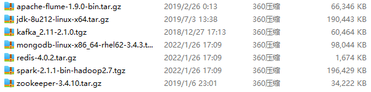

工具链接：https://pan.baidu.com/s/1H4kWBJKv9SG1OMgBrbAJQQ?pwd=1111 
提取码：1111 


**到Liunx上 (路径: /opt/software)**

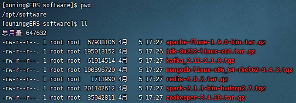

## 2.1 MongoDB（单节点）环境配置

```shell
# 进入/opt/software 文件夹下
[ouning@ERS ~]$ cd /opt/software/
# 将压缩包解压到指定目录
[ouning@ERS software]$ tar -zxvf mongodb-linux-x86_64-rhel62-3.4.3.tgz -C /opt/module/
# 新开一个窗口,进入/opt/module 文件夹下 将其改名为mongodb
[ouning@ERS module]$ mv mongodb-linux-x86_64-rhel62-3.4.3/ mongodb/

# 在安装目录下创建data文件夹用于存放数据和日志
[ouning@ERS mongodb]$ mkdir /opt/module/mongodb/data/
# 在data文件夹下创建db文件夹，用于存放数据
[ouning@ERS mongodb]$ mkdir /opt/module/mongodb/data/db/
# 在data文件夹下创建logs文件夹，用于存放日志
[ouning@ERS mongodb]$ mkdir /opt/module/mongodb/data/logs/
# 在logs文件夹下创建log文件
[ouning@ERS mongodb]$ touch /opt/module/mongodb/data/logs/mongodb.log

# 在data文件夹下创建mongodb.conf配置文件
[ouning@ERS mongodb]$ touch /opt/module/mongodb/data/mongodb.conf
# 在mongodb.conf文件中输入如下内容
[ouning@ERS mongodb]$ vim ./data/mongodb.conf
```

```properties
#端口号
port = 27017
#数据目录
dbpath = /opt/module/mongodb/data/db
#日志目录
logpath = /opt/module/mongodb/data/logs/mongodb.log
#设置后台运行
fork = true
#日志输出方式
logappend = true
#开启认证
#auth = true
```

**完成MongoDB的安装后，启动MongoDB服务器：**

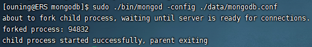

```shell
# 启动MongoDB服务器
[ouning@ERS mongodb]$ sudo ./bin/mongod -config ./data/mongodb.conf
# 访问MongoDB服务器
[ouning@ERS mongodb]$ ./bin/mongo
# 停止MongoDB服务器
[ouning@ERS mongodb]$ sudo ./bin/mongod -shutdown -config ./data/mongodb.conf
```


## 2.2 Redis（单节点）环境配置

```shell
# 进入/opt/software 文件夹下
[ouning@ERS ~]$ cd /opt/software/
# 将压缩包解压到指定目录
[ouning@ERS software]$ tar -zxvf redis-4.0.2.tar.gz -C /opt/module/
# 进入Redis源代码目录，编译安装
[ouning@ERS module]$ cd redis-4.0.2/
# 安装GCC (任意目录下都可)
[ouning@ERS redis-4.0.2]$ sudo yum install –y gcc-c++

# 编译源代码
[ouning@ERS redis-4.0.2]$ make MALLOC=libc
# 编译安装
[ouning@ERS redis-4.0.2]$ sudo make install
# 显示图片中的五个install则表示安装成功
```

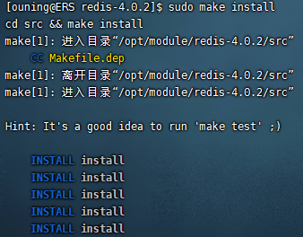

> **常见错误**：在没有安装gcc环境下，如果执行了make，不会成功！安装环境后，第二次make有可能报错：
>
> Jemalloc/jemalloc.h:没有那个文件
>
> 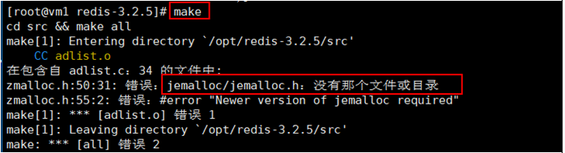
>
> 解决： 运行 make distclean之后再make
>
> ④编译，执行make命令！
>
> ⑤编译完成后，安装，执行make install命令！
>
> 
>
> ⑥文件会被安装到 /usr/local/bin目录
>
> 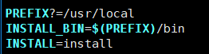
>
> 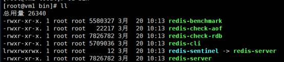
>
>  

```shell
# 创建配置文件
[ouning@ERS redis-4.0.2]$ sudo cp /opt/module/redis-4.0.2/redis.conf /etc/ 
# 修改配置文件中以下内容
[ouning@ERS redis-4.0.2]$ sudo vim /etc/redis.conf
#创建log文件夹
[ouning@ERS redis-4.0.2]$ mkdir log
#创建本地数据库文件夹
[ouning@ERS redis-4.0.2]$ mkdir rdbfile
```

```bash
#136行  #是否以后台daemon方式运行，默认不是后台运行
daemonize yes
#159行  #redis的PID文件路径（可选）
pidfile /opt/module/redis-4.0.2/redis.pid
#70行  #绑定主机IP，默认值为127.0.0.1，我们是跨机器运行，所以需要更改
bind 0.0.0.0
#174行  #定义log文件位置，模式log信息定向到stdout，输出到/dev/null（可选）
logfile  "/opt/module/redis-4.0.2/log/redis.log"
#268行  #本地数据库存放路径，默认为./，编译安装默认存在在/usr/local/bin下（可选）
dir "/opt/module/redis-4.0.2/rdbfile"
```

**在安装完Redis之后，启动Redis**

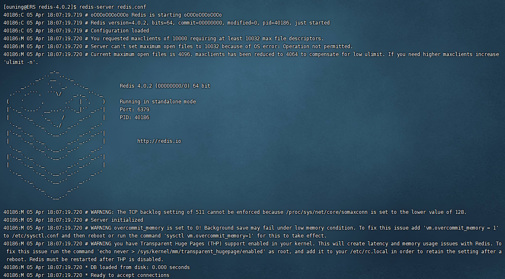

```shell
# 启动Redis服务器
[ouning@ERS redis-4.0.2]$ redis-server redis.conf
# 连接Redis服务器
[ouning@ERS redis-4.0.2]$ redis-cli
# 停止Redis服务器
[ouning@ERS redis-4.0.2]$ redis-cli shutdown
```


## 2.3 Spark（单节点）环境配置

```shell
# 进入/opt/software 文件夹下
[ouning@ERS ~]$ cd /opt/software/
# 将压缩包解压到指定目录
[ouning@ERS software]$ tar -zxvf spark-2.1.1-bin-hadoop2.7.tgz -C /opt/module/
# 新开一个窗口,进入/opt/module 文件夹下 将其改名为spark
[ouning@ERS module]$ mv spark-2.1.1-bin-hadoop2.7/ spark/
# 进入spark目录
[ouning@ERS module]$ cd spark/

# 复制slave配置文件
[ouning@ERS spark]$ cp ./conf/slaves.template ./conf/slaves    
# 修改slave配置文件
[ouning@ERS spark]$ vim ./conf/slaves
#在文件最后将本机主机名进行添加
ERS

# 复制Spark-Env配置文件
[ouning@ERS spark]$ cp ./conf/spark-env.sh.template ./conf/spark-env.sh 
# 修改env配置文件
[ouning@ERS spark]$ vim ./conf/spark-env.sh
# 直接在文件最后添加下面两行
SPARK_MASTER_HOST=ERS         #添加spark master的主机名
SPARK_MASTER_PORT=7077        #添加spark master的端口号
```

**安装完成之后，启动Spark**

```shell
# 启动Spark集群 (在spark目录下)
[ouning@ERS spark]$ sbin/start-all.sh
```

访问Spark集群，浏览器访问http://ERS:8080

如果访问失败, 试着关闭Linux防火墙

```
systemctl stop firewalld.service
```

就可以访问了

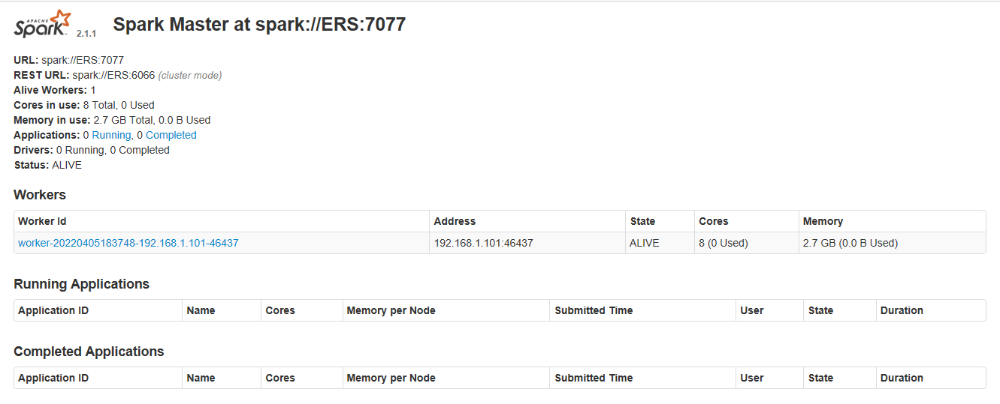


```shell
# 关闭Spark集群
[ouning@ERS spark]$ sbin/stop-all.sh
```

### spark报错

```
[ouning@ERS spark]$ /opt/module/spark/sbin/start-all.sh
org.apache.spark.deploy.master.Master running as process 70506.  Stop it first.
ERS: ssh: Could not resolve hostname ers: Name or service not known
(无法解析主机名:名称或服务不知道)
```

需要修改hosts文件

```
[ouning@ERS ~]$ cat /etc/hosts
127.0.0.1   localhost localhost.localdomain localhost4 localhost4.localdomain4
::1         localhost localhost.localdomain localhost6 localhost6.localdomain6
[ouning@ERS ~]$ sudo vim /etc/hosts
```

添加自己的主机名(192.168.1.101 ERS)

```
127.0.0.1   localhost localhost.localdomain localhost4 localhost4.localdomain4
::1         localhost localhost.localdomain localhost6 localhost6.localdomain6
192.168.1.100 hadoop100
192.168.1.101 ERS
```


##  2.4 Zookeeper（单节点）环境配置

```shell
# 进入/opt/software 文件夹下
[ouning@ERS ~]$ cd /opt/software/
# 将压缩包解压到指定目录
[ouning@ERS software]$ tar -zxvf zookeeper-3.4.10.tar.gz -C /opt/module/
# 进入zookeeper安装目录
[ouning@ERS module]$ cd zookeeper-3.4.10/
# 创建data数据目录
[ouning@ERS zookeeper-3.4.10]$ mkdir data/
# 复制zookeeper配置文件
[ouning@ERS zookeeper-3.4.10]$ cp ./conf/zoo_sample.cfg ./conf/zoo.cfg
```

配置:

```shell
# 修改zookeeper配置文件
[ouning@ERS zookeeper-3.4.10]$ vim ./conf/zoo.cfg
#将数据目录地址修改为创建的目录
dataDir= /opt/module/zookeeper-3.4.10/data
```

服务:

```shell
# 启动Zookeeper服务(进入zookeeper目录 cd /opt/module/zookeeper-3.4.10)
[ouning@ERS zookeeper-3.4.10]$ bin/zkServer.sh start

# 查看Zookeeper服务状态
[ouning@ERS zookeeper-3.4.10]$ bin/zkServer.sh status
# 显示下面三行则表示成功启动服务
ZooKeeper JMX enabled by default
Using config: /opt/module/zookeeper-3.4.10/bin/../conf/zoo.cfg
Mode: standalone

# 关闭Zookeeper服务
[ouning@ERS zookeeper-3.4.10]$ bin/zkServer.sh stop
```

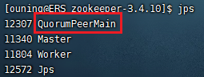

## 2.5 Flume-ng（单节点）环境配置

```shell
# 进入/opt/software 文件夹下
[ouning@ERS ~]$ cd /opt/software/
# 将压缩包解压到指定目录
[ouning@ERS software]$ tar -zxvf apache-flume-1.9.0-bin.tar.gz -C /opt/module/
# 新开一个窗口,进入/opt/module 文件夹下 将其改名为flume
[ouning@ERS module]$ mv apache-flume-1.9.0-bin/ flume
# 等待项目部署时使用 (等会处理)
```

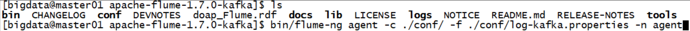

### 配置并启动flume

```
[ouning@ERS flume]$ cd conf/
[ouning@ERS flume]$ vim log-kafka.properties
```

在flume的conf目录下新建log-kafka.properties，对flume连接kafka做配置：

```properties
agent.sources = exectail
agent.channels = memoryChannel
agent.sinks = kafkasink

# For each one of the sources, the type is defined
agent.sources.exectail.type = exec
# 下面这个路径是需要收集日志的绝对路径，改为自己的日志目录
#agent.sources.exectail.command = E:/graduation_project/tail/tail.exe -f D:/develop/hadoop/ECommerceRecommendSystem/businessServer/src/main/log/agent.log
agent.sources.exectail.command = E:/graduation_project/tail/tail.exe -f E:/graduation_project/ECommerceRecommendSystem/businessServer/src/main/log/agent.log
agent.sources.exectail.interceptors=i1
agent.sources.exectail.interceptors.i1.type=regex_filter
# 定义日志过滤前缀的正则
agent.sources.exectail.interceptors.i1.regex=.+PRODUCT_RATING_PREFIX.+
# The channel can be defined as follows.
agent.sources.exectail.channels = memoryChannel

# Each sink's type must be defined
agent.sinks.kafkasink.type = org.apache.flume.sink.kafka.KafkaSink
agent.sinks.kafkasink.kafka.topic = log
agent.sinks.kafkasink.kafka.bootstrap.servers = localhost:9092
# leader收到leader replica 对一个消息的接受ack才增加offset，然后继续生产
agent.sinks.kafkasink.kafka.producer.acks = 1
agent.sinks.kafkasink.kafka.flumeBatchSize = 20

#Specify the channel the sink should use
agent.sinks.kafkasink.channel = memoryChannel

# Each channel's type is defined.数据存储于内存，优势：传输速度快；劣势：可靠性差
agent.channels.memoryChannel.type = memory

# Other config values specific to each type of channel(sink or source)
# can be defined as well
# In this case, it specifies the capacity of the memory channel
agent.channels.memoryChannel.capacity = 10000
```


```shell
# 配置好后，启动flume：
[ouning@ERS flume]$ ./bin/flume-ng agent -c ./conf/ -f ./conf/log-kafka.properties -n agent -Dflume.root.logger=INFO,console
```

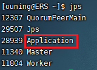


## 2.6 Kafka（单节点）环境配置

```shell
# 进入/opt/software 文件夹下
[ouning@ERS ~]$ cd /opt/software/
# 将压缩包解压到指定目录
[ouning@ERS software]$ tar -zxvf kafka_2.11-2.1.0.tgz -C /opt/module/
# 新开一个窗口,进入/opt/module 文件夹下 将其改名为kafka
[ouning@ERS module]$ mv kafka_2.11-2.1.0/ kafka/
# 进入kafka目录
[ouning@ERS module]$ cd kafka/   
# 修改kafka配置文件
[ouning@ERS kafka]$ vim config/server.properties
```

配置:

```shell
#31行下
#修改主机名(直接添加)
host.name=ERS
#修改服务端口号(直接添加)
port=9092
#修改Zookeeper服务器地址(修改)#120行下
zookeeper.connect=ERS:2181
```

服务:

```shell
# 启动kafka服务 !!! 启动之前需要启动Zookeeper服务
[ouning@ERS kafka]$ 
/opt/module/kafka/bin/kafka-server-start.sh -daemon /opt/module/kafka/config/server.properties
# 关闭kafka服务
[ouning@ERS kafka]$ /opt/module/kafka/bin/kafka-server-stop.sh

# 创建topic (创建前启动kafka服务)
[ouning@ERS kafka]$ bin/kafka-topics.sh --create --zookeeper ERS:2181 --replication-factor 1 --partitions 1 --topic recommender
# kafka-console-producer
[ouning@ERS kafka]$ bin/kafka-console-producer.sh --broker-list ERS:9092 --topic recommender
# kafka-console-consumer
[ouning@ERS kafka]$ bin/kafka-console-consumer.sh --bootstrap-server ERS:9092 --topic recommender
```

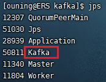

## 安装JDK

```
[root@ERS ~]# rpm -qa | grep -i java | xargs -n1 sudo rpm -e --nodeps
```

将jdk导入到opt目录下面的software文件夹下面

解压JDK到/opt/module目录下

```
[root@ERS software]# 
tar -zxvf jdk-8u212-linux-x64.tar.gz -C /opt/module/
```

配置JDK环境变量

​    （1）新建/etc/profile.d/my_env.sh文件

```
sudo vim /etc/profile.d/my_env.sh
#添加如下内容	
#JAVA_HOME
export JAVA_HOME=/opt/module/jdk1.8.0_212
export PATH=$PATH:$JAVA_HOME/bin
```

刷新下my_env.sh文件

```
[ouning@ERS module]$ source /etc/profile.d/my_env.sh
```

**测试JDK是否安装成功**

```bash
[ouning@ERS module]$ java -version

#如果能看到以下结果、则Java正常安装

java version "1.8.0_212"
Java(TM) SE Runtime Environment (build 1.8.0_212-b10)
Java HotSpot(TM) 64-Bit Server VM (build 25.212-b10, mixed mode)
```

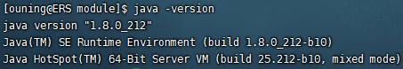


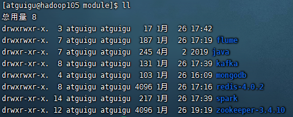

## 防火墙问题

**1:查看防火状态**
	systemctl status firewalld
	如果是这样就开着呢

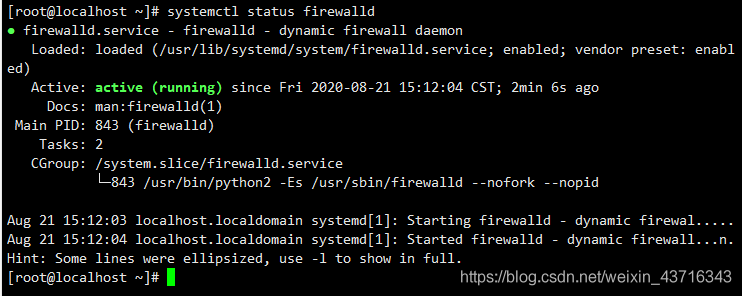

​	如果是这样就是关着

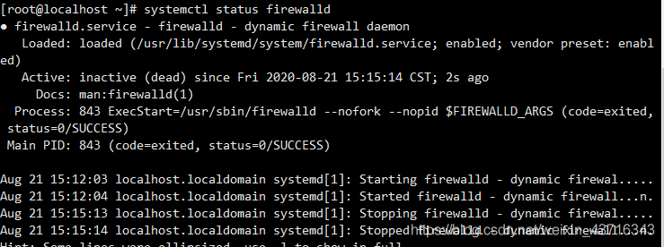

**2:暂时关闭防火墙**

​	systemctl stop firewalld


Linux永久关闭防火墙 firewalld和sellinux设置
必须设置 最好设置永久性若是暂时关闭 下次开启还要设置 所以建议永久性关闭

关闭 firewalld：
	systemctl disable firewalld #永久关闭,即设置开机的时候不自动启动
关闭 selinux：
	修改配置文件（永久关闭selinux可以使用vi命令打开/etc/sysconfig/selinux 文件将SELINUX=disable）
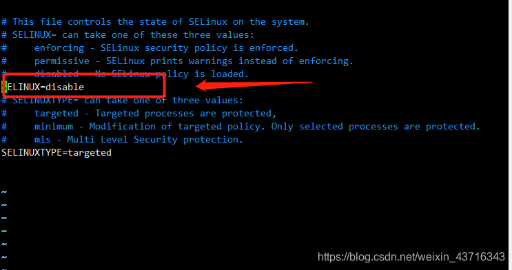

然后reboot 重启虚拟机就OK了


#### 使用说明

### MongoDB

```bash
#启动MongoDB服务器
cd /opt/module/mongodb
sudo ./bin/mongod -config ./data/mongodb.conf

#访问MongoDB服务器
cd /opt/module/mongodb
./bin/mongo

#查看MongoDB服务
ps -ef | grep mongodb.conf

#停止MongoDB服务器
cd /opt/module/mongodb
sudo ./bin/mongod -shutdown -config ./data/mongodb.conf
```


### Redis

```bash
#启动Redis服务器
redis-server /etc/redis.conf

#连接Redis服务器
redis-cli

#查看redis服务
ps -ef | grep redis

#停止Redis服务器
redis-cli shutdown
```


### Spark

```bash
#启动Spark集群
/opt/module/spark/sbin/start-all.sh

#关闭Spark集群
/opt/module/spark/sbin/stop-all.sh
```


### Zookeeper

```bash
#启动Zookeeper服务
cd /opt/module/zookeeper-3.4.10
./bin/zkServer.sh start

#关闭Zookeeper服务
cd /opt/module/zookeeper-3.4.10
./bin/zkServer.sh stop

#查看Zookeeper服务状态
cd /opt/module/zookeeper-3.4.10
./bin/zkServer.sh status
```


### Kafka

```bash
#启动kafka服务
/opt/module/kafka/bin/kafka-server-start.sh -daemon /opt/module/kafka/config/server.properties

#关闭kafka服务
/opt/module/kafka/bin/kafka-server-stop.sh
```


### 关机

```bash
sudo shutdown -h now
```


### flume

```bash
# 启动flume
cd /opt/module/flume
./bin/flume-ng agent -c ./conf/ -f ./conf/log-kafka.properties -n agent -Dflume.root.logger=INFO,console

# 启动生产者
cd /opt/module/kafka
./bin/kafka-console-producer.sh --broker-list ERS:9092 --topic recommender
 
 # 消费者
cd /opt/module/kafka
./bin/kafka-console-consumer.sh --bootstrap-server ERS:9092 --from-beginning --topic recommender
```


### Windos环境下(zookeeper+kafka+flume)

```bash
# Win下启动命令

# zookeeper启动:
E:\graduation_project\zookeeper-3.4.10\bin\zkServer.cmd


# kafka启动:
E:\graduation_project\kafka\bin\windows\kafka-server-start.bat E:\graduation_project\kafka\config\server.properties


# flume启动:
# E:\graduation_project\flume\bin\flume-ng agent -c E:\graduation_project\flume\conf -f # E:\graduation_project\flume\conf\log-kafka.properties -n agent -property flume.root.logger=INFO,console

# ERS_flume启动:
E:\graduation_project\flume\bin\flume-ng agent -c E:\graduation_project\flume\conf -f E:\graduation_project\flume\conf\log-kafka101.properties -n agent -property flume.root.logger=INFO,console
```


#### 参与贡献

1.  Fork 本仓库
2.  新建 Feat_xxx 分支
3.  提交代码
4.  新建 Pull Request


#### 特技

1.  使用 Readme\_XXX.md 来支持不同的语言，例如 Readme\_en.md, Readme\_zh.md
2.  Gitee 官方博客 [blog.gitee.com](https://blog.gitee.com)
3.  你可以 [https://gitee.com/explore](https://gitee.com/explore) 这个地址来了解 Gitee 上的优秀开源项目
4.  [GVP](https://gitee.com/gvp) 全称是 Gitee 最有价值开源项目，是综合评定出的优秀开源项目
5.  Gitee 官方提供的使用手册 [https://gitee.com/help](https://gitee.com/help)
6.  Gitee 封面人物是一档用来展示 Gitee 会员风采的栏目 [https://gitee.com/gitee-stars/](https://gitee.com/gitee-stars/)
